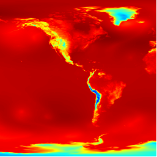
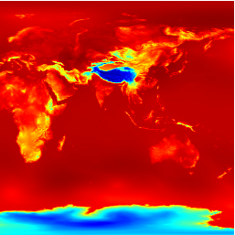

# What is mapcache ?

"MapCache is a server that implements tile caching to speed up access to WMS layers. The primary objectives are to be fast and easily deployable, while offering the essential features (and more!) expected from a tile caching solution." 

> [Source : www.mapserver.org/mapcache ](http://www.mapserver.org/mapcache/)


> [Slideshare](http://fr.slideshare.net/tbonfort/modgeocache-mapcache-a-fast-tiling-solution-for-the-apache-web-server)

# How to use this image

## Build mapcache

This image is built under ubuntu.
```
docker build -t pamtrak06/mapcache:latest https://raw.githubusercontent.com/pamtrak06/mapcache-ubuntu/master/Dockerfile
```

Embedded wmts example from Data source : Environnement Canada, (licence)[http://dd.meteo.gc.ca/doc/LICENCE_GENERAL.txt]

## Run Mapcache

Boot docker
```
$ boot2docker start
```

Run container
```
$ docker run -i -t pamtrak06/ubuntu-utopic-mapcache2
```

Exit container without stop it
```
CTRL+P  &  CTRL+Q
```

Open a terminal session on e running container
```
$ docker exec -i -t pamtrak06/ubuntu-utopic-mapcache2 /bin/bash
```

Get docker vm ip : 
```
$ boot2Docker ip => 192.168.59.103
```

GetCapabilities
```
http://192.168.59.103/mapcache/wmts/?service=wmts&request=getCapabilities
```

GetTile
```
http://192.168.59.103/mapcache/wmts/?service=WMTS&request=GetTile&format=image/png&width=1600&height=600&srs=EPSG:4326&layer=GDPS.ETA_P0_PRESSURE&TileMatrixSet=WGS84&TileMatrix=0&TileRow=0&TileCol=0&time=2014-12-09T06:00:00Z

http://192.168.59.103/mapcache/wmts/?service=WMTS&request=GetTile&format=image/png&width=1600&height=600&srs=EPSG:4326&layer=GDPS.ETA_P0_PRESSURE&TileMatrixSet=WGS84&TileMatrix=0&TileRow=0&TileCol=1&time=2014-12-09T06:00:00Z
```



## Configure container
Mapcache configuration file could be fully modified or replaced.
Prerequisite : open a terminal session in the container.

```
$ vi /etc/apache2/conf-available/mapcache.xml
```
configure mapcache.xml with help from http://mapserver.org/fr/mapcache/config.html,
and then after modification restart apache server like
```
$ apachectl restart
```

Take care about mapcache cache strategy (with type="disk" all is stored in container)

Mapcache configuration file could be generate from script mapcache-run.sh, arguments are :
```
$ cd /etc/apache2/conf-available/
$ ./mapcache.sh <wms url> <project name>
```
Example :
```
$ cd /etc/apache2/conf-available/
$  ./mapcache.sh http://geo.weather.gc.ca/geomet/?lang=E geometca
$ ls mapcache.xml
```
